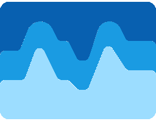

# iActivity

A premium, minimalist macOS system monitor featuring a stunning **Liquid Glass HUD**, real-time activity tracking, and a **native macOS squircle design**. Built with Swift and SwiftUI for maximum performance and a premium aesthetic.



## Core Features

- **Liquid Glass UI**: A beautiful, translucent HUD that floats on your desktop, providing a modern alternative to cluttered system monitors.
- **Real-Time Data Visualization**:
  - **Disk Read/Write Graphs**: Monitor your SSD throughput with dual-history charts showing instantaneous read and write speeds.
  - **Battery Energy Impact**: Track real-time power consumption in **Watts** alongside a historical charge/drain level graph.
  - **CPU/GPU Usage**: Smooth Catmull-Rom interpolated charts for activity history.
- **Native Squircle Design**: A redesigned category picker featuring unified **macOS-style squircles** for a premium, system-native look and feel.
- **Full Thermal Monitoring**: Real-time temperature readings for every critical component (CPU, GPU, Memory, Disk, Battery).
- **Background-Only Mode**: Runs as a pure menu-bar utility with no Dock icon cluttering your workspace.
- **Persistence**: Built-in **Launch at Login** support ensures iActivity starts with your Mac.
- **Easy Installation**: Intelligent onboarding helps you move the app to the `/Applications` folder and set up permissions in seconds.
- **Top 5 Resource Monitoring**: Identify resource-hungry processes across all categories.
- **Native Performance**: Uses low-level macOS kernel APIs (`libproc`, `IOKit`, `SMC`) for minimal system overhead.

## How to Use

### Installation
1. Download the **[iActivity.dmg](iActivity.dmg)** installer.
2. Drag **iActivity** to the **Applications** shortcut.
3. Launch the app. On first run, it will guide you through the **Setup & Permissions** wizard.

### Navigation
- **HUD Panel**: The main dashboard displays a live history chart, component-specific details (including real-time temperature), and a list of the top 5 most active processes.
- **Menu Bar**: Displays the icon, current temperature, and activity level (e.g., `52° 34%`).
  - **Left Click**: Toggle the HUD Dashboard.
  - **Right Click**: Open the settings menu to toggle theme, appearance, or re-run the setup wizard.

## Building from Source

```bash
# Clone the repository
git clone https://github.com/1mrajeevranjan/iActivity.git

# Navigate to the project
cd iActivity

# Build for release
swift build -c release

# Package into .app
cp .build/release/iActivity iActivity.app/Contents/MacOS/iActivity
```

### Requirements
- macOS 15.0 or later (Recommended for best performance)
- Xcode 16.0+ (for building with Swift 6.0)

## License
Created by Rajeev Ranjan. All rights reserved.
