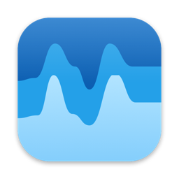

# iActivity

A native macOS menu bar system monitor — CPU, GPU, memory, disk, battery, and network — presented in a frosted-glass popover that anchors to its own menu bar icon, in the style of Calendar and Control Center.



## Features

- **Six live categories** — CPU, GPU, Memory, Disk, Battery, Network — each with a hero gauge, detail tiles, a history chart, and a top-5 process breakdown.
- **Native popover presentation** — the dashboard drops from the menu bar icon with a genuine pointed beak, matching Apple's own menu extras. Re-anchors on every open as neighboring menu bar icons shift, and slides its beak to stay aimed at the icon if the panel gets clamped against a screen edge.
- **Glass pill tab bar** — switching categories slides a shared glass pill under the selection with a spring animation; content transitions in the same direction. Respects Reduce Motion.
- **Full thermal monitoring** — real-time temperature for every component via SMC, in Celsius or Fahrenheit.
- **Settings window** (native grouped form, `⌘,`):
  - Launch at Login
  - Show/hide Dock icon
  - Appearance: Light / Dark / Auto
  - Temperature unit: Celsius / Fahrenheit
  - Menu bar category picker
  - Show/hide temperature in the menu bar
  - Refresh interval: 1s / 2s / 5s
- **Power-aware by design** — the five categories not shown in the menu bar, and the system-wide process scanner, are fully paused while the dashboard is closed and resume instantly when it's opened. Idle CPU use is a fraction of a percent.
- **Accessible** — VoiceOver labels throughout, Reduce Motion and Reduce Transparency respected, Full Keyboard Access, Increase Contrast–aware.
- **Menu bar only** — no Dock icon by default (optional), launches at login on request.

## Usage

On first launch, a welcome screen offers to enable Launch at Login and, if the app isn't already there, move itself to `/Applications`.

- **Left-click** the menu bar icon — toggle the dashboard.
- **Right-click** — Settings…, Quit.
- **Esc** — closes the Settings window.

## Requirements

- macOS 26 (Tahoe) or later
- Swift 6.2+ / Xcode with a matching SDK, to build from source

## Building from source

```bash
git clone https://github.com/1mrajeevranjan/iActivity.git
cd iActivity

# Debug build + run
swift build
.build/debug/iActivity

# Release build
swift build -c release
```

To package as a distributable `.app` / `.dmg`, run:

```bash
./build_and_package.sh
```

## Testing

Unit tests cover panel-anchoring geometry, temperature conversion, and the settings enums, using [Swift Testing](https://developer.apple.com/documentation/testing):

```bash
swift test
```

## Project structure

```
iActivity/
├── iActivityApp.swift       # App entry point, menu bar item, right-click menu, Settings window
├── Monitors/                 # One file per data source (CPU, GPU, Memory, Disk, Battery, Network,
│                              #   Process list) plus SystemMonitor (orchestrator) and PanelManager
│                              #   (popover window + anchoring)
├── Views/                    # SwiftUI dashboard: MainDashboardView, one view per category,
│   └── Components/           #   plus shared card/chart/tile components
├── Theme/                    # Design tokens (spacing, radius, colors, panel geometry)
├── Utilities/                # AppSetup (launch at login, Dock visibility, first-run install)
└── Tests/iActivityTests/     # Swift Testing unit tests
```

## Architecture notes

- **Data collection** uses low-level system APIs directly — `host_processor_info`, `libproc`, IOKit, and SMC — rather than shelling out to CLI tools, keeping overhead minimal.
- Each monitor owns its own `Timer` and refresh cadence; `SystemMonitor` pauses/resumes them based on whether the dashboard is visible and which category the menu bar is displaying.
- The dashboard panel is a borderless `NSPanel` hosting SwiftUI content; its beak shape and the card are drawn as one continuous path so a translucent material fills both without a visible seam.

## License

No license has been specified for this project — all rights reserved by the author. Contact the repository owner before reuse or redistribution.
